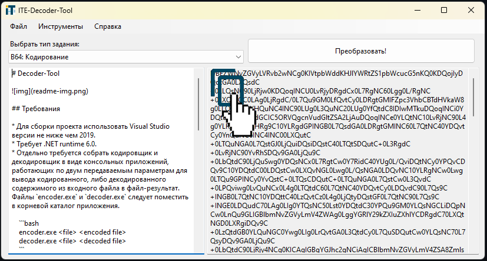

# Decoder-Tool

Утилита для быстрых действий по кодированию и декодированию данных из буфера обмена и файлов. Ускоряет работу тестировщиков и работников технической поддержки.



## Требования

* Для сборки проекта использовать Visual Studio версии не ниже чем 2019.
* Требует .NET runtime 6.0.
* Отдельно требуется собрать кодировщик и декодировщик в виде консольных приложений, работающих по двум передаваемым параметрам для вывода кодированного, либо декодированного содержимого из входного файла в файл-результат. Файлы `encoder.exe` и `decoder.exe` следует поместить в корневой каталог приложения.

    ```bash
    encoder.exe <file> <encoded file>
    decoder.exe <file> <decoded file>
    ```

## Функционал и особенности

* Кодирование и декодирование в формате Base64 и внутреннем, создание тестовых файлов.
* Не содержит кода с ключами и методами внутреннего шифрования. Для работы требует консольное приложение, которого нет в проекте. Таким образом достигается модульность и сокрытие методов шифрования.
* Работа с буфером обмена на чтение и запись минимизирует количество операций и экономит время тестировщика. Чтобы декодировать сообщение достаточно иметь его в буфере обмена перед запуском Decoder-Tool.
* Автоматическая генерация uuid для тестовых файлов продукта.
* Расширена работа с сообщениями тестового агента: zip пакеты, подсчёт количества метрик в экшене.
* Открытие и сохранение данных в текстовый файл. Drug'n'Drop файла в редактор.
* Настраиваемый набор иснтрументов. Запоминание выбранных настроек для последующего запуска приложения.

## Известные проблемы

* Не отключается декод экшенов из меню, также дублируется.
* Баг отрицательного кол-ва экшенов при подсчёте.
* Если декодирование неудачно, файл output не перезаписывается и в правом редакторе получается неверные данные, оставшиеся с прошлой удачной попытки.
* Может зависнуть на большом объёме данных.
